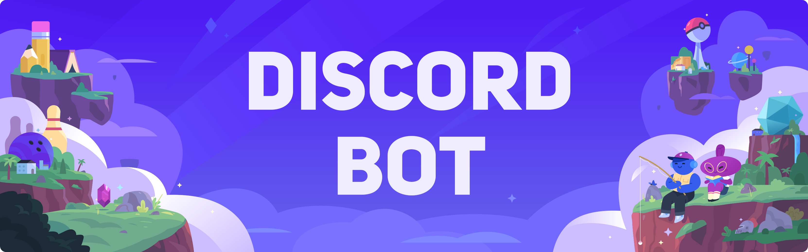

<<<<<<< HEAD

   
  

    
=======
# Discord v13 Bot

   
  

    
>>>>>>> 18dcf5ecb4401a172fbdb92d1b04488be8508cb5
  

   
  

    
  

<<<<<<< HEAD

## Intent

  

[Discord Developer Portal](https://discord.com/developers/applications)'dan tüm intentleri açın! Yoksa hata alırsınız.

=======
>>>>>>> 18dcf5ecb4401a172fbdb92d1b04488be8508cb5
